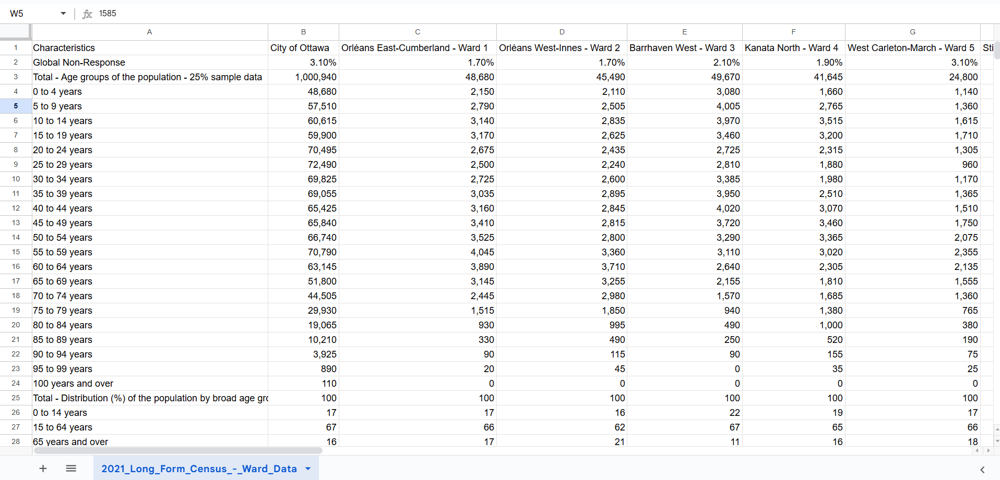
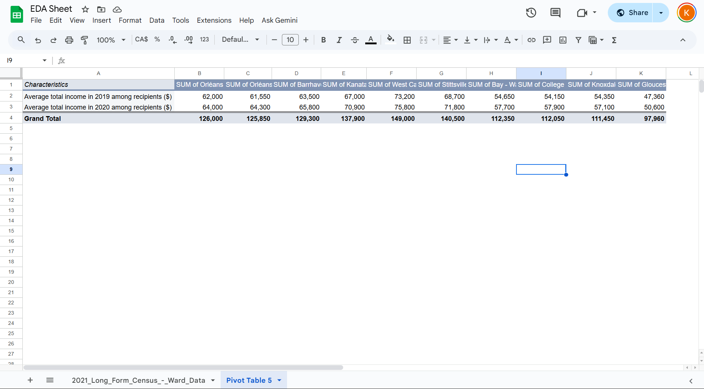
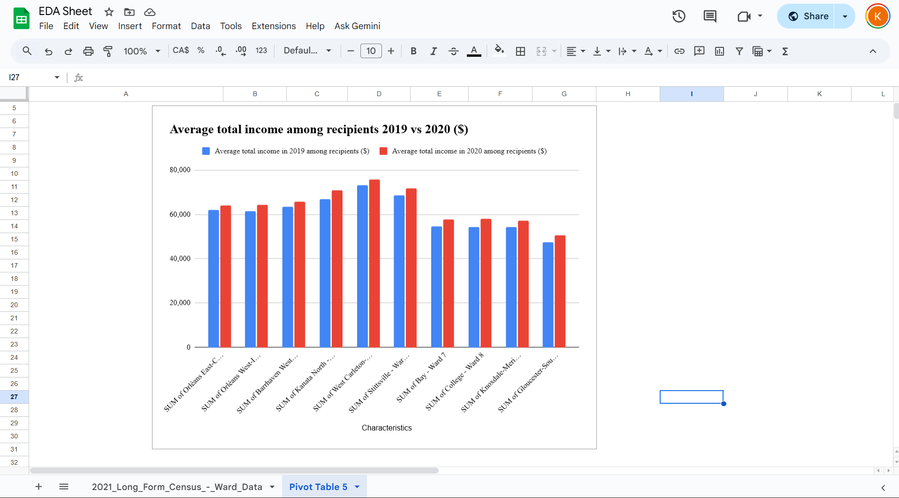

**November 6, 2025**<br>
**MPAD2003 Introductory Data Storytelling**<br>
**Kenzie Mulligan,**<br>
**Presented to Jean-Sébastien Marier**<br>

# Exploratory Data Analysis (EDA) & Pitch

Use one hashtag symbol (`#`) to create a level 1 heading like this one.

## Foreword

For this assignment, you must extract data from a dataset provided by the instructor. You must then clean and analyze the data, create exploratory charts/visualizations, and find a potential story idea. Your assignment must clearly detail your process. You are expected to write about 1500-2000 words, and to include several screen captures showing the different steps you went through. Your assignment must be written with the Markdown format and submitted on GitHub Classroom.

I have been assigning different versions of this project to my digital journalism and data storytelling students for a few years now. Its structure was inspired by the main sections/chapters of [*The Data Journalism Handbook*](https://datajournalism.com/read/handbook/one/). This version was further inspired by the [Key Capabilities in Data Science](https://extendedlearning.ubc.ca/programs/key-capabilities-data-science) program offered by the University of British Columbia (UBC).

**Here are some useful resources for this assignment:**

* [GitHub's *Basic writing and formatting syntax* page](https://docs.github.com/en/get-started/writing-on-github/getting-started-with-writing-and-formatting-on-github/basic-writing-and-formatting-syntax)
* [The template repository for this assignment in case you delete something by mistake](https://github.com/jsmarier/jou4100_jou4500_mpad2003_project2_template)

Did you notice how to create a hyperlink? In Markdown, we put the clickable text between square brackets and the actual URL between parentheses.

And to create an unordered list, we simply put a star (`*`) before each item.

## 1. Introduction
For this assignment, we will analyze a City of Ottawa dataset, collected by Statistics Canada, that provides detailed demographic information about Ottawa’s population, broken down by ward. This dataset shows how population, age, and trends vary across different areas of the city. This dataset includes a handful of different things, like the number of people who speak a certain language, methods of commuting to work, the number of specific age demographics, and average family size. 

In this assignment, we will be getting the data, understanding the data, cleaning the data, analyzing the data, and lastly, conducting a potential story with the data.

[Open Ottawa Dataset Source](https://open.ottawa.ca/datasets/ottawa::2021-long-form-census-ward-data/explore)

[Original Dataset Source CSV](https://raw.githubusercontent.com/jsmarier/files-for-course-assignments/refs/heads/main/2021_Long_Form_Census_-_Ward_Data.csv)

## 2. Getting Data
<b>How we got out data</b>
To import our data from the CSV file to Google Sheets, we followed these steps: first, downloaded our CSV, then opened a new Google Sheets, then chose Upload and selected our CSV file, and picked where we wanted it to go (onto a new sheet), then lastly clicked Import data to load the CSV file onto the new sheet.

<i>Here is an image of the spread sheet once imported</i>


[Public Link to Google Sheet](https://docs.google.com/spreadsheets/d/1mI6C_dRIXe7h5A-3btVx26ezhnZnFNimz0qGm6IQro4/edit?usp=sharing)

<b>General Observations</b>
When taking a first look at the data, it looks organized and simple to read. There are 2603 rows and 2 columns. The data looks fairly clean as numbers are aligned consistently, with no obvious typos, and each cell has a numeric or percentage value. Some cells contain percentages while others contain counts, so there are mixed data types.
<b>Specific Observations</b>
When looking at the data, a few observations can be made. The first column, called “Characteristics,” lists different population groups like “0 to 14 years,” “15 to 64 years,” and “65 years and over.” These are nominal categorical variables because they describe categories rather than numbers. The second column, “City of Ottawa,” shows the total population for each age group using numerical data. These numbers are continuous variables and generally get smaller as the age groups get older. The other columns, such as “Orléans East-Cumberland” and “Barrhaven West,” also show numeric data for each ward, and the numbers change depending on how big or densely populated each ward is.
Another observation is that when looking at the data tracking how many people speak a certain language or where, it is evident that this data takes up a majority of the spreadsheet. From rows 427 to 1928, it is a massive collection and combination of global races and languages, and tracking where they are in Ottawa.

<b>The questions that were sparked when looking at this data include the following:</b>
What does the area you live in near Ottawa say about you as an individual?
How can the city use this information to improve or support areas?


Use two hashtag symbols (`##`) to create a level 2 heading like this one.

To include a screen capture, use the sample code below. Your images should be saved in the same folder as your `.md` file.

<br>
*Figure 1: The "Import file" prompt on Google Sheets.*

**Here are examples of functions and lines of code put in grey boxes:**

1. If you name a function, put it between "angled" quotation marks like this: `IMPORTHTML`.
1. If you want to include the entire line of code, do the same thing, albeit with your entire code: `=IMPORTHTML("https://en.wikipedia.org/wiki/China"; "table", 5)`.
1. Alternatively, you can put your code in an independent box using the template below:

``` r
=IMPORTHTML("https://en.wikipedia.org/wiki/China"; "table", 5)
```
This also shows how to create an ordered list. Simply put `1.` before each item.

## 3. Understanding Data

### 3.1. VIMO Analysis

Use three hashtag symbols (`###`) to create a level 3 heading like this one. Please follow this template when it comes to level 1 and level 2 headings. However, you can use level 3 headings as you see fit.

For this VIMO analysis, we followed the methods talked about in the Statistics Canada video on data accuracy, looking at valid, invalid, missing and outlier values. We then focused on three specific sections of the dataset: the population by age group in each area, income levels, and the average household population. Each of these sections appears valid, as the data uses appropriate numeric values, including decimals where necessary. For example, the column showing how many people earn a certain income correctly uses whole numbers to represent counts.
When checking the integrity of the data, we looked for consistent headers, duplicated rows or columns, and whether the names of places matched the official list. Nothing seemed inconsistent in the sections we analyzed, the headers were clear, and the data remained consistent across the columns.
In terms of missingness, there were no blank or missing cells. Finally, while checking for outliers, nothing appeared unusual. For example, in the row showing the average household size, all values stayed within a range of 1.6 to 3.1 residents, which seems realistic for household data in Ottawa.
Overall, the dataset appears to be accurate, consistent, and reliable. Each section we examined followed proper data formatting, with no missing information or major inconsistencies. The values also stayed within realistic ranges, suggesting that the data was collected and organized carefully. Because of this, the dataset can be confidently used for further analysis, such as comparing age demographics, income levels, or household sizes across different areas in Ottawa.


Support your claims by citing relevant sources. Please follow [APA guidelines for in-text citations](https://apastyle.apa.org/style-grammar-guidelines/citations).

**For example:**

As Cairo (2016) argues, a data visualization should be truthful...

### 3.2. Cleaning Data

To clean the data set, we first used the built-in Google Sheets data cleaning suggestion tool, which trimmed extra white space throughout all cells. We used the same tool to look at unique variables to check whether something was mispelled, capitalized differently, or repeated inaccurately.

Then, we removed rows that were not relevant to the rest of the data set, such as extra intervals of different age groups and repeated rows of data of certain variables in the "Characteristics" column. One example of this was a row with "Education" as a characteristic, and a row right underneath reading "13. Education" with the same data in each column. 

Next, we inserted the trimmed dataset into OpenRefine to find more repeated "Characteristics" through clustering, and then deleted said characteristics within the Google Sheet. We then separated the numbers from the front of certain characteristics by using the SPLIT function, after having created two rows to the left of the first row to account for the spillover, which separated the values at the "." following the number. To apply the function to the rest of the cells, we dragged the corner of that cell. We trimmed the remaining whitespace after having used the function by selecting the column and using the "Trim Whitespace" option offered under the "Data" section in Google Sheets. After copying and pasting the function result into the "Characteristics" column, we deleted the extra rows needed to write the function to make it appear cleaner overall. 

Lastly, we changed the numerical values to their respective "Numbers", which was the case for most of the data, or "Percentages" in the "Format" option.

<b>Function: <b>```markdown
            =SPLIT(C1993, ".")

<br>
*Figure 2: The first 28 rows of the cleaned data set.*

### 3.3. Exploratory Data Analysis (EDA)

We chose to look at income levels because they show how people in Ottawa live and how equal the city is. The data helps us see differences between rich and poor areas.

We created the pivot table with the average level of income in Canadian Dollars in 2019 and in 2020 including wards 1-10. What stands out is the difference in average income between 2019 and 2020. Despite the pandemic, people in Ottawa were generally making more money in 2020 as compared to 2019. 

The highest levels of income occur in wards 4, 5, and 6, making the data in the bar chart appear almost in the shape of a normal distribution.

From this, we learned that most people earn around the middle range, but there are still smaller groups with very low or very high income. We also learned that the pandemic did not affect people in Ottawa's income as much as we had expected, and therefpre the next step could be to compare income with other factors, such as housing or education, to understand the aspects life in different parts of the city.

**This section should include a screen capture of your pivot table, like so:**

<br>
*Figure 3: A pivot table representing how many people in different areas of Ottawa have the corresponding average level of income.*

**This section should also include a screen capture of your exploratory chart, like so:**

<br>
*Figure 4: A bar graph of the different levels of income in 2019 and 2020 across Ottawa.*

## 4. Potential Story

While the initial intention for a potential story was to discover the differences in income in 2019 versus 2020, this yielded little significant results, therefore it may be more beneficial to look at other factors for a potential story, such as location, given by the different wards. 

When comparing simply wards 1-10, it is clear that wards 7 onward make significantly less money, $10,000 less annually to be exact, than the other wards. This could be looked further into and compared and contrasted with other factors such as the types of jobs available, the cost of living, or number of residents to a household in these areas. It could be that there are less people of working age in a particular ward, meaning the lower population of individuals *to* make income causes the entire ward to have a lower *average* income overall. 

Another example, if we were to look at types of jobs available, may show more government jobs closer to the centre of the city, which means replacing one of the wards in similar areas, such as 4, 5, and 6, with ward 17, the city centre, would give us an indication of whether or not the significant difference of the annual income could relate to job availability. Additionally, due to the different kinds of jobs available, the cost of living closer to the city may be increased, therefore people generally have to have a higher income in order to be living there.

Overall, there are many possibilities of stories within the chosen data from the greater data set, including but not limited to what factors, such as job availability or cost of living, influence income, and whether it be due to geographical location or number of eligible working residents in a household.

## 5. Conclusion

Insert text here.

## 6. References

Include a list of your references here. Please follow [APA guidelines for references](https://apastyle.apa.org/style-grammar-guidelines/references). Hanging paragraphs aren't required though.

**Here's an example:**

Bounegru, L., & Gray, J. (Eds.). (2021). *The Data Journalism Handbook 2: Towards A Critical Data Practice*. Amsterdam University Press. [https://ocul-crl.primo.exlibrisgroup.com/permalink/01OCUL_CRL/hgdufh/alma991022890087305153](https://ocul-crl.primo.exlibrisgroup.com/permalink/01OCUL_CRL/hgdufh/alma991022890087305153)
